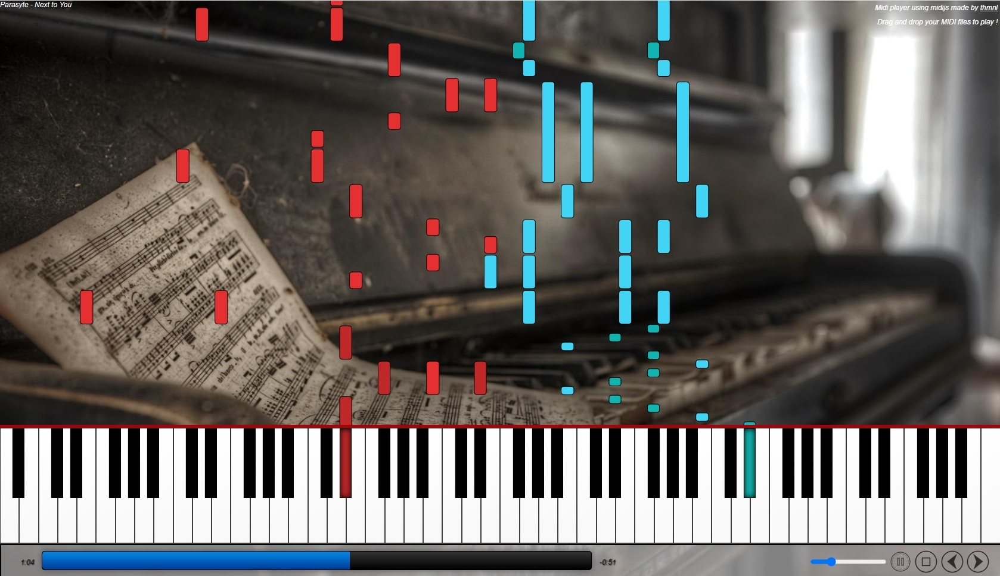

# MidiPlayerJS
JavaScript drag &amp; drop MidiPlayer  
Result : https://thibaultmanuel.com/MIDIPlayer/  

  

## Usage
Expose your MIDIPlayer.html 
For example, with Python : `python -m http.server 8000`  
Then go to http://localhost:8000/MIDIPlayer.html 

